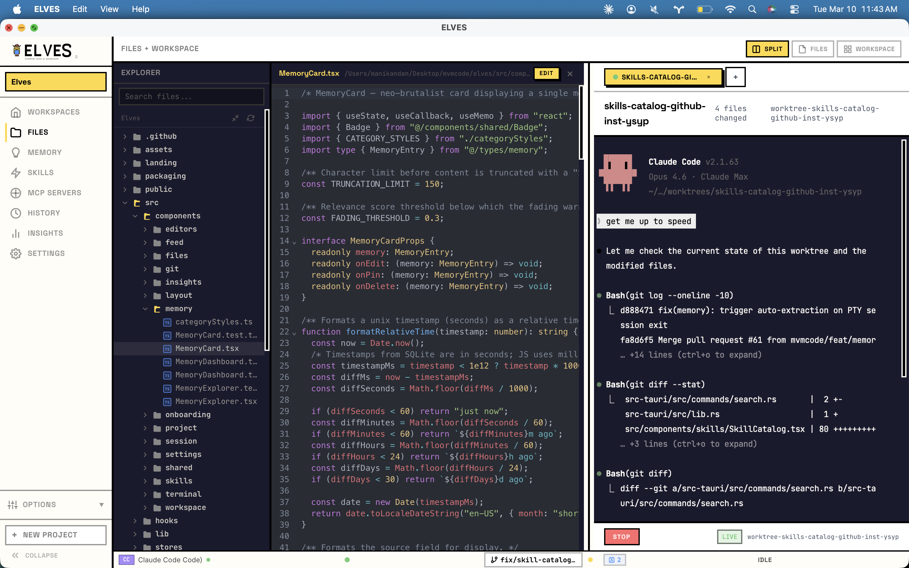
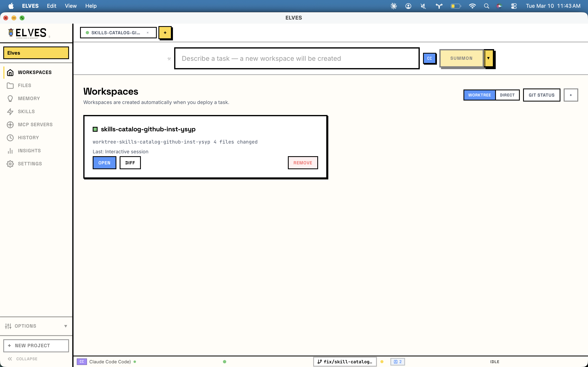
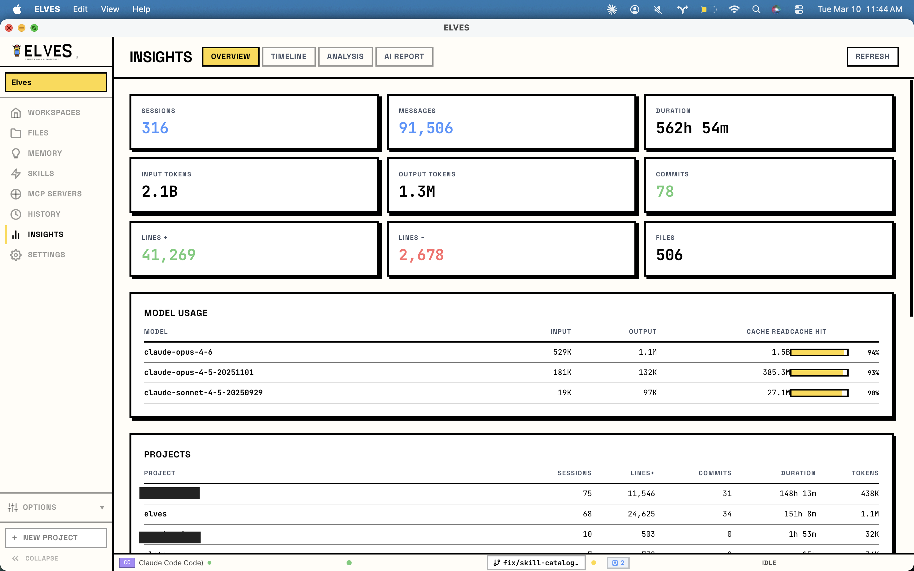
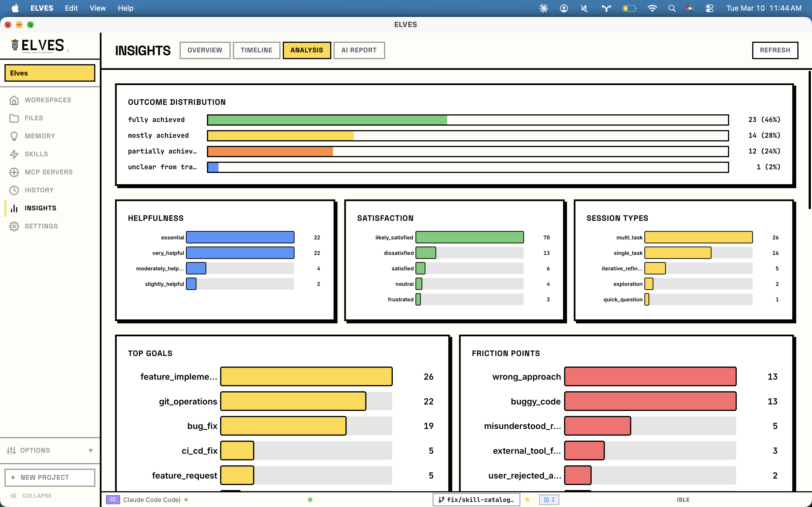
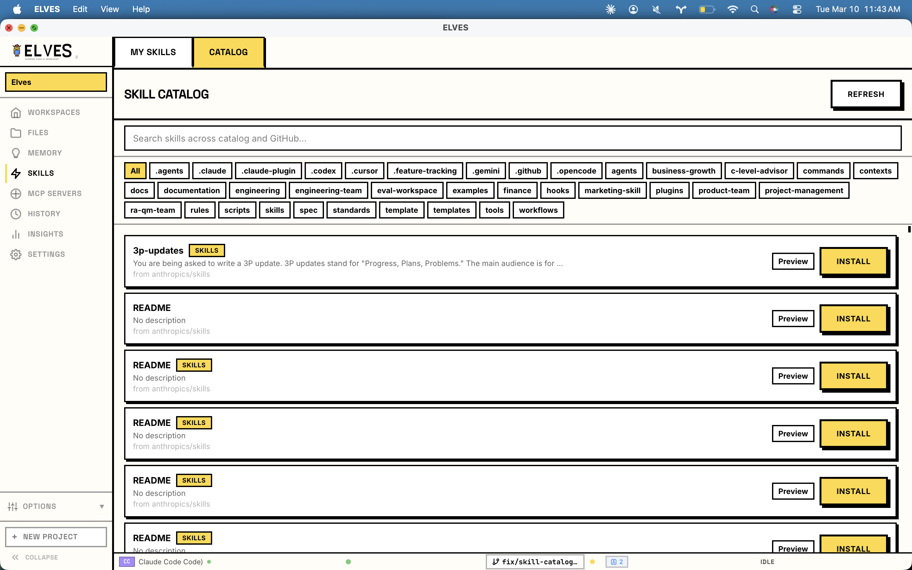
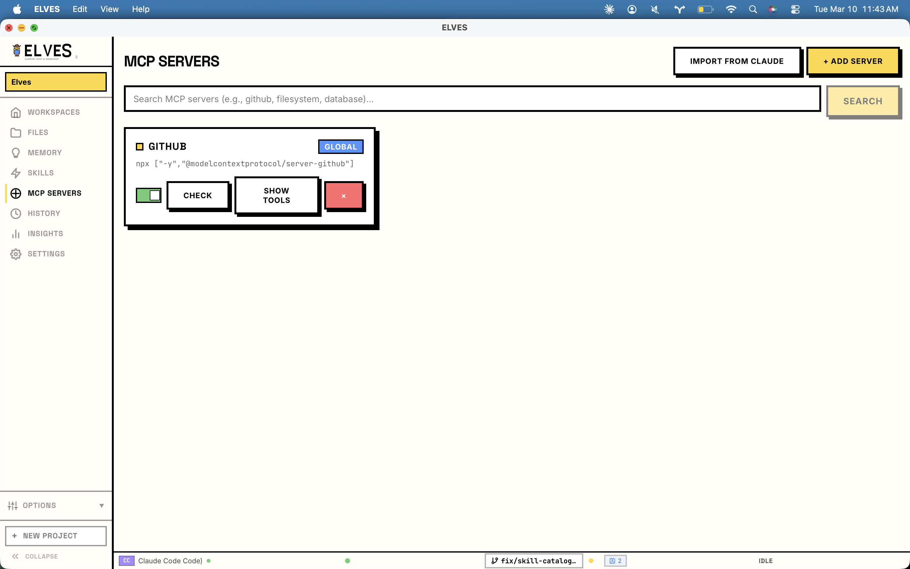

<p align="center">
  
</p>

<h3 align="center"><strong>AI agent orchestration for your codebase.</strong></h3>

<p align="center">
A desktop app for orchestrating AI agent teams with worktree-isolated workspaces.<br/>
Type a task. Get an isolated git worktree with a live embedded terminal. Ship the branch when it's done.
</p>

<p align="center">
  <a href="LICENSE"></a>
  <a href="https://github.com/mvmcode/elves"></a>
  <a href="https://tauri.app"></a>
  <a href="https://github.com/mvmcode/elves/actions/workflows/ci.yml"></a>
</p>

---

## What is ELVES?

ELVES is a Tauri v2 desktop app (macOS) that orchestrates [Claude Code](https://docs.anthropic.com/en/docs/claude-code) and [OpenAI Codex](https://openai.com/index/codex/) in isolated git worktrees with embedded terminals. You type a task, ELVES creates a worktree, spawns the agent in a live PTY, and gives you a terminal view to watch it work. When it's done, you ship the branch or discard the worktree.

Not just for coding. Research, analysis, writing, planning, data processing — if Claude Code or Codex can do it, ELVES can manage it with full workspace isolation.

Everything is local. Projects, memory, sessions — all stored on your machine in SQLite. No cloud. No accounts. No telemetry.

---

<!-- Image viewer — click arrows or thumbnails to browse -->
<div align="center">

<a href="#img-workspaces"></a>

<br/>

<table><tr>
<td align="center"><a href="#img-workspaces"><br/><sub>Workspaces</sub></a></td>
<td align="center"><a href="#img-split"><br/><sub>Files + Terminal</sub></a></td>
<td align="center"><a href="#img-insights"><br/><sub>Insights</sub></a></td>
<td align="center"><a href="#img-analysis"><br/><sub>Analysis</sub></a></td>
<td align="center"><a href="#img-skills"><br/><sub>Skills</sub></a></td>
<td align="center"><a href="#img-mcp"><br/><sub>MCP Servers</sub></a></td>
</tr></table>

</div>

<details id="img-workspaces">
<summary><strong>Workspaces</strong> — Task bar, workspace cards, worktree/direct modes</summary>
<br/>
<p align="center"></p>
<p align="center"><a href="#img-mcp">&larr; MCP Servers</a> &nbsp;&bull;&nbsp; <a href="#img-split">Files + Terminal &rarr;</a></p>
</details>

<details id="img-split">
<summary><strong>Files + Workspace</strong> — Split pane with file explorer, code viewer, and live terminal</summary>
<br/>
<p align="center"></p>
<p align="center"><a href="#img-workspaces">&larr; Workspaces</a> &nbsp;&bull;&nbsp; <a href="#img-insights">Insights &rarr;</a></p>
</details>

<details id="img-insights">
<summary><strong>Insights Overview</strong> — Sessions, tokens, commits, model usage, project breakdown</summary>
<br/>
<p align="center"></p>
<p align="center"><a href="#img-split">&larr; Files + Terminal</a> &nbsp;&bull;&nbsp; <a href="#img-analysis">Analysis &rarr;</a></p>
</details>

<details id="img-analysis">
<summary><strong>Insights Analysis</strong> — Outcomes, helpfulness, satisfaction, goals, friction points</summary>
<br/>
<p align="center"></p>
<p align="center"><a href="#img-insights">&larr; Insights</a> &nbsp;&bull;&nbsp; <a href="#img-skills">Skills &rarr;</a></p>
</details>

<details id="img-skills">
<summary><strong>Skill Catalog</strong> — Searchable catalog with category tags, preview, and install</summary>
<br/>
<p align="center"></p>
<p align="center"><a href="#img-analysis">&larr; Analysis</a> &nbsp;&bull;&nbsp; <a href="#img-mcp">MCP Servers &rarr;</a></p>
</details>

<details id="img-mcp">
<summary><strong>MCP Servers</strong> — Import from Claude, add servers, health checks, tool listing</summary>
<br/>
<p align="center"></p>
<p align="center"><a href="#img-skills">&larr; Skills</a> &nbsp;&bull;&nbsp; <a href="#img-workspaces">Workspaces &rarr;</a></p>
</details>

---

## Features

### Worktree-First Workspaces
Every task becomes a git worktree — fully isolated on disk with its own branch. Work happens in an embedded terminal with a live PTY. When done, "Ship It" to push, merge (with strategy picker), extract memories, and clean up — all in one atomic flow. Or "Remove" to discard the worktree and free disk space. Parallel tasks never interfere with each other. Multi-repo projects are supported with coordinated worktree creation across repositories.

### Floor System
Multiple concurrent sessions organized as "floors" — tabbed workspaces within a project. Each floor has its own terminal, PTY session, and worktree. Start a new task while another is still running; ELVES automatically creates a new floor.

### Embedded Terminal
A real PTY terminal wired to Claude Code or Codex via xterm.js. Watch the agent work in real-time, respond to permission prompts inline via overlay popups, and interact directly when needed. Split terminal view for team sessions shows each agent's terminal side by side.

### Multi-Runtime Support
Works with Claude Code Agent SDK and Codex CLI. Pick your runtime per-project or per-task. A unified adapter layer normalizes both event streams — the frontend never knows which engine is underneath. Task options (model, permission mode, effort level, budget cap) are configurable per-session via the TaskBar options row.

### Persistent Memory
SQLite-backed memory with FTS5 full-text search. After each session, ELVES extracts decisions, learnings, and context. Relevance scores decay over time and get boosted on access — frequently useful memories stay sharp while stale ones fade. Before each new task, relevant memory is automatically injected into your agent's context.

### Skill Catalog
Unified skill management combining custom skills, Claude Code slash commands (`~/.claude/commands/`), and project-local commands. Searchable catalog with categories, live markdown preview, and JSON export.

### File Attachments
Attach files to your task prompt — contents are inlined into the agent's context. Supports up to 10 files (500KB total) with drag-and-drop or file picker.

### Stall Detection
Monitors active sessions for stalled agents. If a PTY session stops producing output for an extended period, ELVES detects the stall and surfaces it to the user.

### First-Run Wizard
Three-step onboarding for new users: runtime detection with install hints and re-scan, project creation, and a ready screen. Triggered automatically on fresh installs with no projects.

### Runtime Health Checks
StatusBar shows a live health indicator for each runtime with version info. Clickable popover shows detailed status. Periodic 5-minute re-checks keep status current. If the default runtime is missing, ELVES auto-switches to the available one. Summon button is disabled with an explanation when no runtimes are detected.

### Auto-Update
Non-blocking Homebrew update check on launch. If a newer version is available, shows a toast with a one-click copy command for `brew upgrade --cask elves`.

### Neo-Brutalist UI
Thick black borders. Hard drop shadows (no blur). Saturated colors. Oversized typography. Snappy 100-200ms animations. Dark mode with full design token support. This isn't another gray SaaS dashboard — it looks like a bold poster that happens to orchestrate AI agents.

### Project-Scoped Configuration
Each project gets a `.elves/config.json` for default runtime, MCP servers, and memory settings. Portable, committable, shareable with teammates.

### Everything Local
All data lives on your machine. SQLite for structured data, `.elves/` per project for config. No cloud sync. No accounts. Export everything anytime.

### Usage Insights Dashboard
Four-tab analytics view built on real Claude Code telemetry. **Overview** shows 9 KPIs (sessions, messages, tokens, commits, lines, files), per-model token breakdown with cache hit rates, and per-project summaries. **Timeline** shows daily session and message counts plus an hour-of-day heatmap. **Analysis** shows outcome distribution, helpfulness, satisfaction, session types, goals, friction, tool/language usage, feature adoption, and a recent sessions list with AI-generated summaries. **AI Report** renders Claude Code's full narrative HTML report in a sandboxed iframe. Falls back to "Coming Soon" for Codex.

### Session History & Replay
Every session records a full event log with cost tracking and duration. Step through past sessions event-by-event, compare sessions side-by-side, resume completed sessions via `claude --resume`, or export as HTML replays.

---

## Prerequisites

- **macOS 13+** (Ventura or later)
- **Node.js 18+**
- **Rust** (for building from source — install via [rustup](https://rustup.rs))
- At least one AI runtime:
  - [Claude Code CLI](https://docs.anthropic.com/en/docs/claude-code) — `npm install -g @anthropic-ai/claude-code`
  - [Codex CLI](https://github.com/openai/codex) — `npm install -g @openai/codex`

---

## Quick Start

### Install via Homebrew (recommended)

```bash
brew install --no-quarantine --cask mvmcode/tap/elves
```

The `--no-quarantine` flag prevents macOS Gatekeeper from blocking the app (ELVES is not notarized — it's an open-source project without an Apple Developer account).

### Or Download Directly

Download the latest `.dmg` from [GitHub Releases](https://github.com/mvmcode/elves/releases).

> **Gatekeeper note:** Since ELVES is not notarized, macOS may say the app is "damaged" or "can't be verified." To fix this, right-click `ELVES.app` → **Open** → click **Open** in the dialog. Or run:
> ```bash
> xattr -cr /Applications/ELVES.app
> ```

---

## Getting Started

### Install from Source

```bash
git clone https://github.com/mvmcode/elves.git
cd elves
npm install
npm run tauri dev
```

On first launch, ELVES scans your PATH for `claude` and `codex` binaries, detects available agents and models, and drops you into the workspace grid — ready to start a task.

### Build for Production

```bash
npm run tauri build
```

This produces a `.app` bundle in `src-tauri/target/release/bundle/macos/`. To create a distributable DMG with proper code signing:

```bash
codesign --force --deep --sign - src-tauri/target/release/bundle/macos/ELVES.app
hdiutil create -volname "ELVES" -srcfolder src-tauri/target/release/bundle/macos/ELVES.app -ov -format UDZO ELVES.dmg
```

---

## Architecture Overview

ELVES uses Tauri v2: a Rust backend handles compute-heavy work (process management, SQLite, file watching) while a WebView frontend renders the UI. They communicate over bidirectional IPC.

The key architectural insight is the **Unified Agent Protocol**. Both Claude Code and Codex emit different event formats. ELVES normalizes everything into a single typed stream (`ElfEvent`) that the frontend subscribes to. The frontend never imports anything runtime-specific — switching from Claude Code to Codex is invisible to the UI layer.

```
┌─────────────────────────────────────────────────────────────────┐
│                        React Frontend                           │
│  ┌───────────┐ ┌───────────┐ ┌──────────┐ ┌─────────────────┐  │
│  │ Workspace │ │ Terminal  │ │ Memory   │ │ Skills/Settings │  │
│  │ (Worktree │ │ (xterm.js │ │ Explorer │ │ (Catalog, MCP,  │  │
│  │  Cards,   │ │  Split,   │ │ (FTS5)   │ │  Config, Theme) │  │
│  │  Ship It) │ │  PTY)     │ │          │ │                 │  │
│  └─────┬─────┘ └─────┬─────┘ └────┬─────┘ └───┬─────────────┘  │
│        └──────────┬───┘            │           │                │
│   Floor System    │ Tauri IPC      │           │                │
│   File Attach     │                │           │                │
│   Keyboard ───────┤                │           │                │
│   Stall Detect    │                │           │                │
└───────────────────┼────────────────┴───────────┘────────────────┘
┌───────────────────┴─────────────────────────────────────────────┐
│                        Rust Backend                             │
│  ┌──────────┐ ┌─────────────────┐ ┌──────────────────────────┐  │
│  │ PTY      │ │ SQLite (WAL)    │ │ Workspace Manager        │  │
│  │ Manager  │ │ Projects, Elves │ │ Git worktree lifecycle   │  │
│  │ (spawn,  │ │ Sessions, Events│ │ Multi-repo support       │  │
│  │  resize, │ │ Memory + FTS5   │ │ Ship It (push/merge/     │  │
│  │  write)  │ │ Skills, MCP     │ │   cleanup)               │  │
│  │          │ │ Templates       │ └──────────────────────────┘  │
│  └────┬─────┘ └─────────────────┘ ┌──────────────────────────┐  │
│       │                           │ Project Config            │  │
│  ┌────┴──────────────────────────┐│ .elves/config.json        │  │
│  │ Unified Agent Protocol Adapter│└──────────────────────────┘  │
│  └────┬──────────────────────┬───┘┌──────────────────────────┐  │
│       │                      │    │ Memory + Interop          │  │
│       │                      │    │ Context builder,          │  │
│       │                      │    │ extraction, decay         │  │
│       │                      │    └──────────────────────────┘  │
└───────┼──────────────────────┼──────────────────────────────────┘
        │                      │
  ┌─────┴───────┐       ┌─────┴────────┐
  │ Claude Code │       │  Codex CLI   │
  │ Agent SDK   │       │  Subprocess  │
  └─────────────┘       └──────────────┘
```

---

## Tech Stack

| Layer | Technology |
|---|---|
| Framework | Tauri v2 (Rust) |
| Frontend | React 19, TypeScript 5.8 |
| Styling | Tailwind CSS v4 |
| Animation | Framer Motion |
| State | Zustand |
| Backend | Rust (2021 edition) |
| Database | SQLite via rusqlite (WAL mode, FTS5) |
| Terminal | xterm.js + portable-pty |
| Process Mgmt | Tokio async runtime |
| Frontend Tests | Vitest + Testing Library |
| Backend Tests | cargo test |

---

## Development

### Setup

```bash
# Clone the repo
git clone https://github.com/mvmcode/elves.git
cd elves

# Install frontend dependencies
npm install

# Start dev server (launches both Vite + Tauri)
npm run tauri dev
```

### Running Tests

```bash
# Frontend tests
npx vitest run

# Rust backend tests
cd src-tauri && cargo test

# Type checking
npx tsc --noEmit
```

### Project Structure

```
elves/
├── src/                         # React frontend
│   ├── components/
│   │   ├── shared/              # Button, Card, Dialog, Badge, Input, Panel,
│   │   │                        # ResizeHandle, DeployButton, Toast, MusicPlayer
│   │   ├── layout/              # Shell, Sidebar, StatusBar, TopBar, TaskBarPickers,
│   │   │                        # FileAttachment, SidebarSettings
│   │   ├── workspace/           # ProjectWorkspace, WorkspaceCard, WorkspaceTerminalView,
│   │   │                        # WorkspaceTabBar, SplitTerminalView, TerminalPane,
│   │   │                        # ShipItDialog, NewWorkspaceDialog, BranchList,
│   │   │                        # DiffViewer, MultiRepoWorkspaceCard, RecentlyShipped
│   │   ├── terminal/            # XTerminal, SessionTerminal, BottomTerminalPanel,
│   │   │                        # LiveEventTerminal
│   │   ├── skills/              # SkillManager, SkillCatalog, SkillDetailEditor,
│   │   │                        # SkillListItem, SkillSidebar, SkillPreviewModal
│   │   ├── editors/             # SkillEditor, McpManager, ContextEditor, TemplateLibrary
│   │   ├── onboarding/          # FirstRunWizard (3-step setup for new users)
│   │   ├── session/             # SessionControlCard, PermissionPopup
│   │   ├── project/             # SessionHistory, SessionComparison, ShareButton,
│   │   │                        # NewProjectDialog
│   │   ├── files/               # FileTreePanel, FileExplorerView, FileExplorer,
│   │   │                        # FileTreeNode, FileSearch, FileViewer
│   │   ├── feed/                # ActivityFeed, SidePanel
│   │   ├── git/                 # BranchSwitcher, DiffViewer, GitPanel
│   │   ├── memory/              # MemoryExplorer, MemoryCard
│   │   ├── insights/            # InsightsView, InsightsOverview, InsightsTimeline,
│   │   │                        # InsightsAnalysis, InsightsReport, BarChart, HeatmapChart
│   │   └── settings/            # MemorySettings, SettingsView, RuntimeSettings,
│   │                            # ThemePicker
│   ├── stores/                  # Zustand stores (app, project, session, ui, memory,
│   │                            # settings, skills, mcp, workspace, templates,
│   │                            # comparison, git, toast, fileExplorer)
│   ├── types/                   # TypeScript types (elf, session, project, memory,
│   │                            # skill, skill-registry, mcp, claude, workspace,
│   │                            # search, runtime, attachment, floor, git-state,
│   │                            # comparison, template, filesystem)
│   ├── hooks/                   # useInitialize, useTeamSession, useSessionEvents,
│   │                            # useSkillActions, useMcpActions, useMemoryActions,
│   │                            # useKeyboardShortcuts, useSessionHistory,
│   │                            # useAutoInteractive, useStallDetection,
│   │                            # useCheckForUpdate, useProjectContext,
│   │                            # useResizable, useTemplateActions, useInsights
│   ├── test/                    # Shared test fixture factories
│   └── lib/                     # elf-names, Tauri IPC wrappers, pty-agent-detector,
│                                # slug, sounds
│
├── src-tauri/                   # Rust backend
│   └── src/
│       ├── agents/              # Runtime detection, claude/codex adapters, claude discovery,
│       │                        # interop, task analyzer, context builder, memory extractor
│       ├── commands/            # Tauri IPC handlers (agents, projects, sessions, tasks,
│       │                        # memory, skills, mcp, export, pty, git, workspace,
│       │                        # filesystem, search, templates, registry, updates, insights)
│       ├── project/             # Project config management (.elves/config.json)
│       └── db/                  # SQLite schema + migrations, CRUD modules
│                                # (projects, sessions, elves, events, memory, skills, mcp)
│
├── assets/logo/                 # ELVES wordmark and logo assets
├── landing/                     # GitHub Pages landing site
│   ├── index.html               # Neo-brutalist landing page with terminal mockup
│   ├── favicon.svg              # Favicon
│   └── og-image-generator.html  # Canvas-based OG image generator (1200x630)
├── CLAUDE.md                    # Engineering standards
├── VISION.md                    # Full product vision
├── DECISIONS.md                 # Architectural decision log
└── CHANGELOG.md                 # Release history
```

### Key Patterns

- **Neo-brutalist components**: 3px black borders, hard drop shadows (`box-shadow: 6px 6px 0px 0px #000`), no border-radius by default, bold saturated colors
- **Tailwind v4**: Design tokens defined via `@theme` in CSS, not a config file
- **Tauri IPC**: `tauri::command` for request/response, `app.emit()` for streaming events
- **Zustand stores**: 14 domain stores (app, project, session, ui, memory, settings, skills, mcp, workspace, templates, comparison, git, toast, fileExplorer) to prevent unnecessary re-renders
- **Hook-per-domain IPC**: Each data domain has a dedicated hook (`useSkillActions`, `useMcpActions`, `useMemoryActions`, `useTemplateActions`) that auto-loads data and provides typed CRUD callbacks
- **Floor system**: Multiple concurrent sessions per project. Each floor has its own PTY, worktree, and terminal. `ensureAvailableFloor` auto-creates a new floor when the active one is busy.
- **Persistent memory**: SQLite + FTS5 full-text search. Relevance decays exponentially (`score *= 0.995^days`), boosted on access. Pinned memories exempt from decay.
- **Pre/post-task hooks**: Before each task, project context is built from relevant memories. After completion, heuristic extraction pulls decisions, learnings, and context from the event stream.
- **Worktree-first workspaces**: Every task is a git worktree under `.claude/worktrees/<slug>`. The "Ship It" flow handles push, merge (merge/rebase/squash), memory extraction, worktree removal, and branch deletion as one atomic action. Multi-repo projects coordinate worktrees across repositories.
- **Direct mode**: For non-git projects, tasks run directly in the project folder without worktree creation.
- **Eager workspace insertion**: Workspaces are added to the store immediately after creation to avoid race conditions between `openWorkspace` and async `listWorkspaces`.
- **Unified agent protocol**: Claude Code and Codex events are normalized into a single typed stream. The interop layer formats context per runtime. Frontend never touches runtime-specific types.
- **Embedded terminal**: PTY via `portable-pty` with xterm.js frontend. Full terminal fidelity including colors, cursor movement, and interactive prompts. Split terminal view for team sessions.
- **Permission popup overlay**: When the PTY agent requests permission, a popup renders over the terminal for inline approve/deny without leaving the view.
- **Global keyboard shortcuts**: Centralized in `useKeyboardShortcuts` hook — Cmd+K (task bar), Cmd+1-9 (projects), Cmd+M (memory)
- **Claude discovery**: Filesystem scan of `~/.claude/` surfaces agents, models, permission modes, and slash commands — no subprocess needed
- **macOS .app PATH resolution**: Shell PATH is resolved at startup via interactive login shell, with fallback to well-known binary directories. PTY binary names are resolved to absolute paths via `which` before spawning.

---

## Roadmap

All core phases are complete. Post-release work focuses on stability, runtime hardening, and UX refinements.

- [x] **Phase 1: Foundation** — Tauri v2 scaffold, design system, SQLite backend, runtime detection
- [x] **Phase 2: Single Elf Mode** — ElfCard, ActivityFeed, live streaming, session management
- [x] **Phase 3: Multi-Elf Teams** — Task analyzer, plan preview, team deployment, task graph, thinking panel
- [x] **Phase 4: Memory & Intelligence** — Persistent memory with FTS5, auto-learning, context injection, memory explorer, settings
- [x] **Phase 5: Visual Editors & Polish** — Skills editor with preview/export, MCP manager with tool listing, context editor with save/diff, keyboard shortcuts
- [x] **Phase 6: Codex Full Support** — Codex adapter with JSONL normalization, multi-agent event attribution, interop layer, runtime picker, template library with seeding + JSON export, session history and comparison
- [x] **Phase 7: Distribution** — CI/CD with clippy, auto-updater with signing, session replay export, Homebrew cask, landing page with app mockup, OG image generator, community files
- [x] **Phase 8: Streaming & Terminal** — Real-time stream-json events, Claude discovery, embedded PTY terminal, session resume, resizable panels, solo terminal mode, native dialogs, TaskBar options
- [x] **Phase 9: Workspace Redesign** — Worktree-first workspaces, Ship It completion flow, project-scoped config, branch management, DiffViewer, merge strategy picker
- [x] **Post-release** — macOS .app PATH resolution, multi-repo support, floor system, skill catalog, file attachments, stall detection, auto-update checks, race condition fixes, PTY/xterm hardening
- [x] **v1.1** — Insights dashboard overhaul (real Claude Code telemetry, model usage, project summaries, AI report), terminal revamp (Channel IPC, WebGL, toolbar, persistence, auto-resume), memory dashboard, split pane layout

---

## Contributing

Contributions are welcome! Before diving in:

1. Read [`CLAUDE.md`](CLAUDE.md) for engineering standards — it covers code quality, testing, documentation, and the neo-brutalist design system in detail
2. Read [`DECISIONS.md`](DECISIONS.md) for architectural context on past choices
3. Read [`VISION.md`](VISION.md) for the full product vision

### Quick guidelines

- Every new component gets a test. No exceptions.
- Every new Tauri command gets an integration test.
- Types are documentation — no `any`, no implicit returns.
- Commit format: `type(scope): description` (e.g., `feat(workspace): add ShipItDialog component`)
- One commit per coherent change. No WIP commits.

---

## Community

- [Contributing Guide](CONTRIBUTING.md)
- [Code of Conduct](CODE_OF_CONDUCT.md)
- [Security Policy](SECURITY.md)
- [Changelog](CHANGELOG.md)

---

## License

[MIT](LICENSE)

---

## Why "ELVES"?

The name stuck from an early prototype where AI agents had animated character avatars. The characters are gone, but the name remains — short, memorable, and easy to type. Think of it as a backronym: **E**xecute **L**ocal **V**ersioned **E**ngineering **S**essions.

> *"You don't do the work. You have ELVES for that."*

---

*Built by Mani & Raghavan.*
